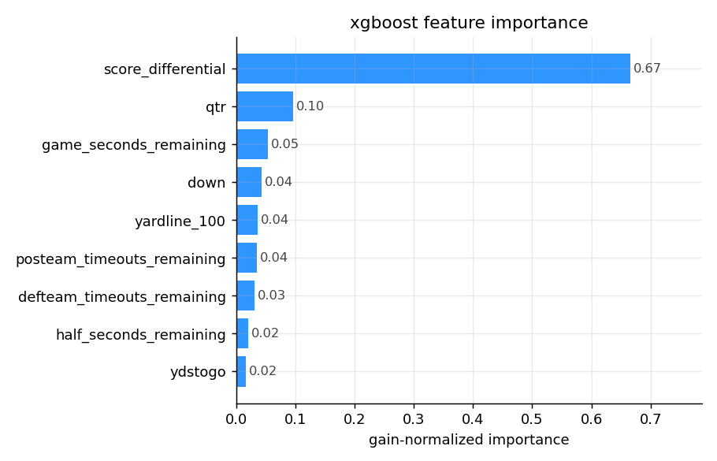
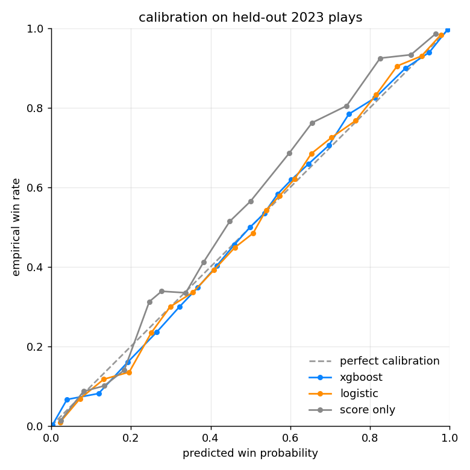
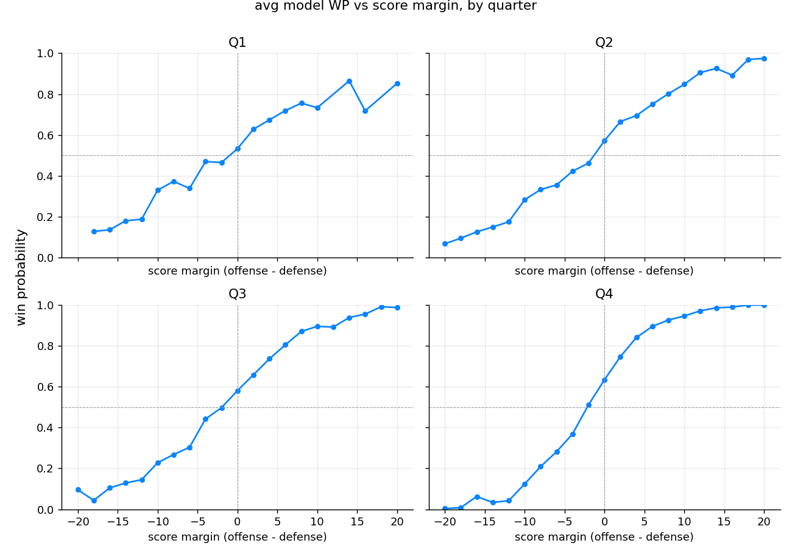
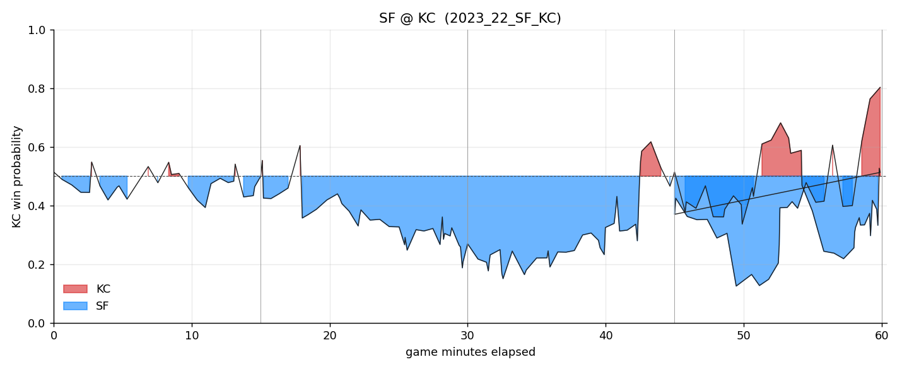

# nflwin

An NFL in-game win probability model trained on 225,536 plays from the 2018-2022 seasons and tested on all of 2023. Two models for comparison: a plain logistic regression and a gradient-boosted tree ensemble (XGBoost). Charts and findings are below.

The data is nflfastR's public play-by-play, pulled from the [nflverse-data](https://github.com/nflverse/nflverse-data) releases. Nothing fancy on the data side, just the standard game-state features you'd find on a betting board.

## Headline numbers (held-out 2023 season, 38,933 plays)

| model              | log loss | brier  | auc    |
|--------------------|----------|--------|--------|
| constant 0.5       | 0.6931   | 0.2500 | 0.500  |
| score-only logit   | 0.5039   | 0.1692 | 0.832  |
| logistic (9 feats) | 0.4899   | 0.1636 | 0.840  |
| **xgboost**        | **0.4850** | **0.1629** | **0.841** |

A few quick takeaways:

- The score-only baseline (a logistic on score margin and nothing else) already gets you to AUC 0.83. That's the bar.
- Adding clock, down, distance, field position, and timeouts buys you another point of AUC and about 4% in log loss. Not nothing, but it's small.
- XGBoost barely beats the logistic at the aggregate level. Where it actually pulls ahead is in the tails (huge leads, two-minute drill) where the WP curve is sharply non-linear.

## What predicts winning?



Score differential is basically two-thirds of the signal. Quarter and time remaining together are another 15%. Down and distance, field position, and timeouts split the rest. That matches intuition: the model is mostly answering "how big is the lead and how much time is left to blow it?"

## Calibration



All three models sit pretty close to the diagonal. The score-only logit underconfidence shows up in the tails (it's too cautious about predicting a blowout). XGBoost is the tightest fit across the full range.

## WP vs score margin, broken out by quarter



This is the chart that makes the model click. In Q1, a 7-point lead is worth maybe 65%. By Q4 the same lead is worth 85%+. The curve gets steeper as the game wears on because there's less time to recover.

## Game replay: Super Bowl LVIII



SF @ KC, the model rolling through the full game. The blue troughs in Q2 and Q3 are SF building their lead. The red spike near the end is KC's game-tying drive, then SF retakes a slim lead before overtime. The dashed line is 50/50.

## How it works

Each play in the dataset becomes a training example. Features are the offensive team's game state right before the snap:

- `down`, `ydstogo`, `yardline_100` (yards from offense to opposing endzone)
- `score_differential`, `qtr`, `game_seconds_remaining`, `half_seconds_remaining`
- `posteam_timeouts_remaining`, `defteam_timeouts_remaining`

Label is whether the offensive team eventually won the game (0/1, ties dropped). Train on 2018-2022, test on 2023. No play from a test game ever leaks into training.

The logistic model standardizes the features first, then fits with L2 regularization. The XGBoost model uses 500 trees, max depth 5, learning rate 0.05, and `hist` for speed.

## Reproducing

```
pip install -r requirements.txt
make all        # fetch + dataset + train + charts
make test       # runs the smoke tests
```

`make fetch` pulls about 580 MB of CSVs. The full pipeline finishes in a few minutes on a laptop.

## Predicting a single state

```
$ python scripts/predict.py --down 3 --ydstogo 8 --yardline 65 \
    --margin -7 --seconds-left 480 --qtr 4 --to-off 2 --to-def 3
wp = 0.213  (xgb)
```

That's a typical "down 7 with 8 minutes left, 3rd and 8 from your own 35" situation. Model says about 1 in 5.

## Repo layout

```
scripts/fetch.py          download nflfastR CSVs
scripts/build_dataset.py  duckdb-driven feature table -> parquet
scripts/train.py          train logit + xgboost, save metrics + calibration
scripts/charts.py         render the four charts
scripts/predict.py        score a single game state from the CLI
tests/test_smoke.py       sanity checks on the trained model
```

## Caveats

The features are intentionally minimal. A serious version would also include team strength priors (vegas spread, EPA-per-play), weather, and home/away. Adding any of those would close the gap to the published nflfastR WP model, which lives around AUC 0.86 on the same kind of holdout.
